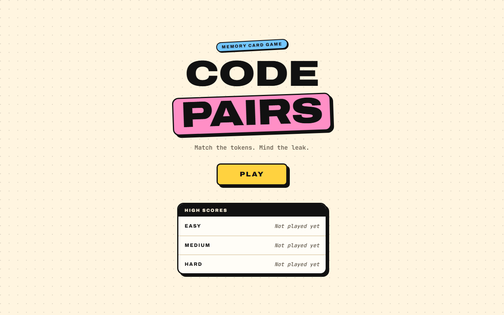
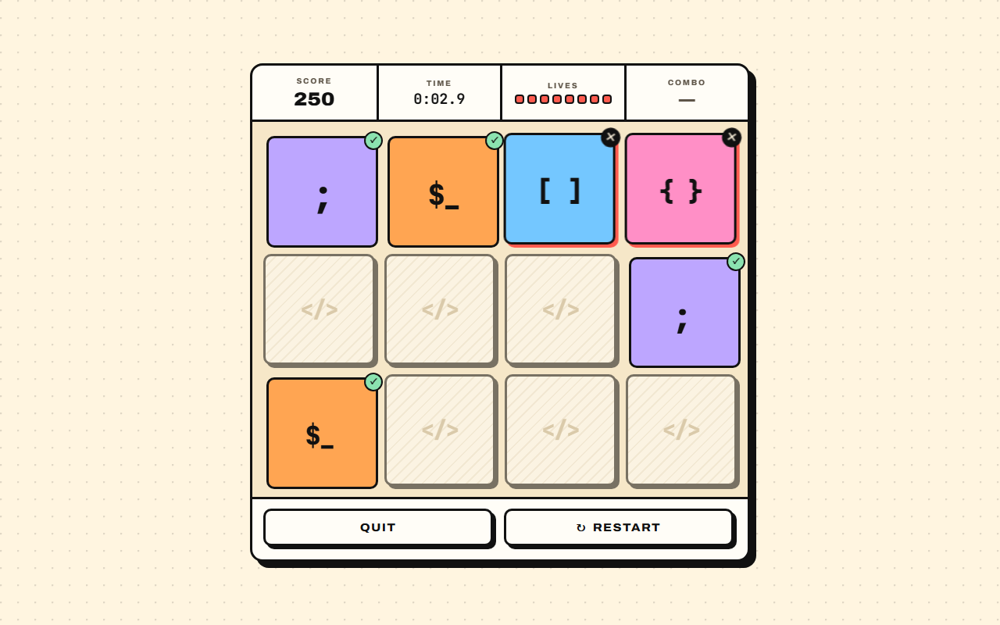
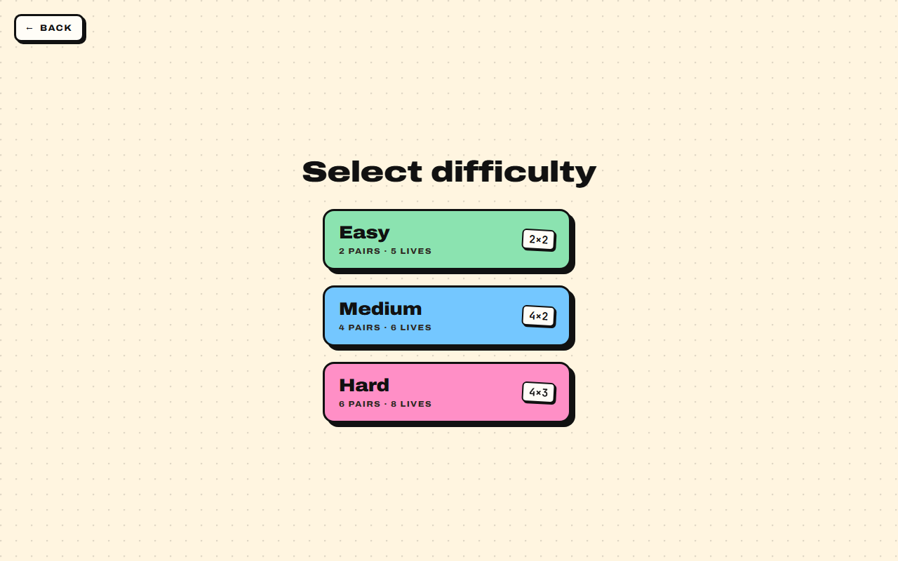
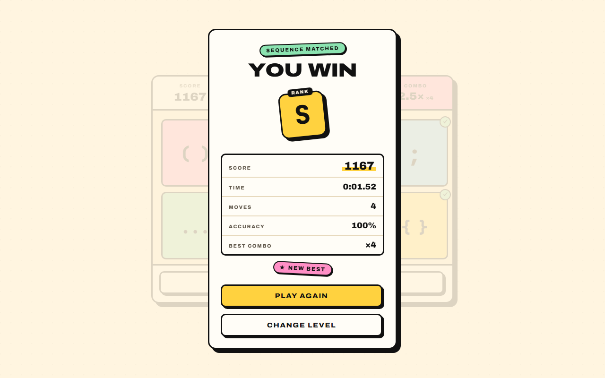
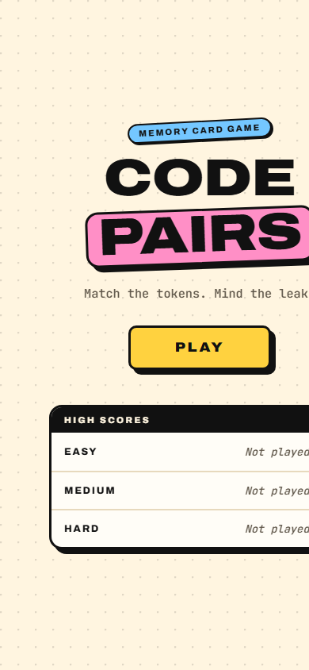
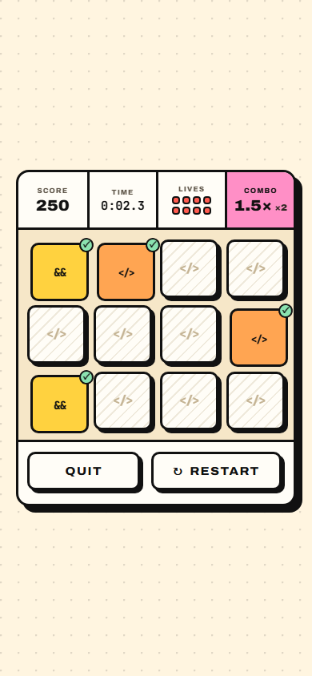

# Code Pairs — a code-themed memory game

## Debug your memory

🎮 **[Play the live demo](https://codepairsgame.netlify.app/)**

Code Pairs is a "concentration" memory-matching game built with **Angular 19**. Flip cards to find matching pairs of code tokens (`{ }`, `=>`, `&&`, `...`), race the clock, and chain matches into combos for a higher score.

It's also a showcase of modern Angular: **standalone components**, a **Signals-based state architecture**, lazy-loaded routes with preloading, persisted high scores, and a bold neo-brutalist design system built entirely on CSS custom properties.

<p align="center">
  
  
</p>

## Contents

- [Features](#-features)
- [How to play](#-how-to-play)
- [Scoring and ranks](#-scoring-and-ranks)
- [Screenshots](#-screenshots)
- [Getting started](#-getting-started)
- [Testing](#-testing)
- [Project structure](#-project-structure)
- [Architecture](#-architecture)
- [Design system: Paper & Ink](#-design-system-paper--ink)
- [Accessibility](#-accessibility)
- [Deployment](#-deployment)
- [Tech stack](#-tech-stack)
- [License](#-license)

## ✨ Features

**Gameplay**

- **Three difficulty levels.** Easy, Medium and Hard, each with its own grid, pair count, lives and par time.
- **Combo scoring.** Consecutive matches ramp a score multiplier up to 3×. Fast finishes and unspent lives earn end-of-game bonuses.
- **Letter-grade ranks.** Every win is graded **S / A / B / C** on accuracy and time against par.
- **Persistent best scores.** Your best result per difficulty is saved in `localStorage`, guarded so it's safe in private mode.
- **Fresh deals every game.** Each game draws a random set of tokens from a pool of 10 and shuffles them.

**Look and feel**

- **Neo-brutalist "Paper & Ink" design.** Cream paper, thick ink outlines, hard offset shadows and a small candy palette. Each pair gets its own colour when revealed, so colour works as a memory aid.
- **Tactile controls.** Buttons and cards lift on hover and press flat onto their shadows.
- **Clear choreography.**
  - Cards deal in with a stagger.
  - A wrong pair shakes once it lands face-up, then flips back after 650ms.
  - Matched pairs pop and sink flat with a ✓ sticker.
  - Results appear a moment after the final pair lands, with a count-up tally, a rank stamp and confetti.
- **Responsive.** The board sizes cards to fit both the width and the height of the viewport, from phones (with `svh` units that respect mobile toolbars) up to large desktops.

**Built to feel responsive**

- **Taps always register.** The element that receives a click never moves; only an inner face animates (see [why](#why-buttons-never-move)).
- **No tap delays.** `touch-action: manipulation` removes double-tap-to-zoom delays while keeping pinch-zoom. Hover effects only apply on devices with a real pointer, so nothing looks stuck after a tap.
- **Instant screen changes.** All lazy routes are preloaded after first paint, so tapping Play or a level never waits on the network.
- **Guarded against double-taps.** A stray second tap can't start a game you didn't pick, press a results button early, or flip a card on a board that was just dealt.

## 🃏 How to play

1. Press **Play** and pick a difficulty.
2. Flip two cards at a time to find matching code-token pairs.
3. Match consecutively to build a combo multiplier.
4. A mismatch costs one life. The wrong pair stays visible for a moment (taps are paused and the other cards dim), then flips back.
5. Clear every pair before you run out of lives to win. Beat par with perfect accuracy for an **S** rank.

| Level  | Grid | Pairs | Lives | Par time |
| ------ | ---- | ----- | ----- | -------- |
| Easy   | 2×2  | 2     | 5     | 12 s     |
| Medium | 4×2  | 4     | 6     | 35 s     |
| Hard   | 4×3  | 6     | 8     | 70 s     |

Keyboard players can Tab between cards and flip with **Enter** or **Space**.

## 🏆 Scoring and ranks

| Event                | Points                                                                  |
| -------------------- | ----------------------------------------------------------------------- |
| Match                | 100 × combo multiplier                                                  |
| Combo multiplier     | 1st match in a streak 1×, 2nd 1.5×, 3rd 2×, 4th 2.5×, 5th and later 3× |
| Mismatch             | −1 life, and the combo resets                                           |
| Time bonus (on a win) | 5 points for every second under par                                   |
| Life bonus (on a win) | 50 points per remaining life                                           |

**Accuracy** is matches ÷ moves, where a move is one pair of flips.

| Rank | Requirement                                     |
| ---- | ----------------------------------------------- |
| S    | 100% accuracy and finished within par           |
| A    | ≥ 80% accuracy and finished within 1.5 × par    |
| B    | ≥ 60% accuracy                                  |
| C    | Anything else (and every loss)                  |

Best scores are kept per difficulty. A higher score wins, and ties go to the faster time.

## 📸 Screenshots

<p align="center">
  
  
</p>

<p align="center">
  
  
</p>

## 🚀 Getting started

### Prerequisites

- [Node.js](https://nodejs.org/) **20 or 22 LTS** (Angular 19 supports `^18.19.1 || ^20.11.1 || >=22.0.0`)
- npm, which ships with Node

The Angular CLI is installed as a project dependency, so `npx ng …` works without a global install. You can still install it globally with `npm install -g @angular/cli`.

### Install and run

```bash
git clone https://github.com/Robotbino/CodePairs.git
cd CodePairs
npm install
npm start
```

Open `http://localhost:4200/`. The dev server reloads on every source change. To use another port, run `npm start -- --port 4321`.

### Scripts

| Command         | What it does                                              |
| --------------- | --------------------------------------------------------- |
| `npm start`     | Dev server (`ng serve`) with hot reload                    |
| `npm run build` | Production build to `dist/code-pairs/browser`             |
| `npm run watch` | Development build that rebuilds on change                  |
| `npm test`      | Unit tests in watch mode (Karma + Jasmine)                 |

## 🧪 Testing

Unit tests use **Karma** and **Jasmine**, with `*.spec.ts` files next to the code they cover. They cover:

- Game rules, combos and scoring.
- The board lock during a mismatch, and the guard against rapid repeat clicks.
- Fresh card ids for every deal.
- Leaving a game mid-play (`abandon()`).
- Screen-reader announcements.
- Best-score persistence.
- Card accessibility labels and formatting helpers.

Single headless run (useful for CI):

```bash
npx ng test --watch=false --browsers=ChromeHeadless
```

> **No Chrome installed?** Karma's Chrome launcher also works with Microsoft Edge. Point `CHROME_BIN` at it first. In PowerShell:
>
> ```powershell
> $env:CHROME_BIN = "C:\Program Files (x86)\Microsoft\Edge\Application\msedge.exe"
> npx ng test --watch=false --browsers=ChromeHeadless
> ```

## 📁 Project structure

The app follows a `core` / `features` split. Every route is a lazy-loaded standalone component.

```
src/
├── index.html                      # Fonts, meta tags, favicon
├── styles/
│   ├── _tokens.scss                # Design tokens: palette, borders, shadows, type, motion
│   └── styles.scss                 # Global primitives: buttons, chips, keyframes, reduced motion
└── app/
    ├── app.component.ts            # Root shell
    ├── app.config.ts               # Router (preloading, input binding), animations
    ├── app.routes.ts               # Lazy routes with page titles: '' · 'difficulty' · 'play'
    ├── core/
    │   ├── data/
    │   │   └── card-deck.ts        # Code-token pool (inline SVG glyphs)
    │   ├── models/
    │   │   ├── game.models.ts      # Types, difficulty config, scoring and ranking
    │   │   └── timing.ts           # Flip, mismatch and results timings
    │   ├── services/
    │   │   ├── game.service.ts     # Signals-based game state and rules
    │   │   ├── scoreboard.service.ts  # Best scores (localStorage)
    │   │   └── confetti.ts         # Dependency-free canvas confetti
    │   └── util/
    │       ├── format.ts           # Clock, time and percentage formatting
    │       └── motion.ts           # prefers-reduced-motion helper
    └── features/
        ├── home/                   # Landing: hero, Play, high scores
        ├── difficulty/             # Level picker
        └── game/                   # Board screen (game.component.ts)
            └── components/
                ├── card/           # Flip card
                ├── hud/            # Score, clock, lives, combo
                ├── results/        # Win / game-over dialog
                └── confetti-canvas/  # Win celebration
public/                             # Static files copied as-is (favicons)
docs/screenshots/                   # Images used in this README
```

## 🧠 Architecture

- **`GameService` is the single source of truth.**
  - Writable signals hold the raw state (`cards`, `phase`, `score`, `combo`, lives, timer and so on).
  - `computed` signals derive everything else: config, multiplier, accuracy, rank.
  - Every transition is an immutable update. Illegal clicks (a locked board, an already-revealed card, a finished game) are ignored by guards.
  - Each flip re-reads the card's live state, so a stale repeat event can never flip the same card twice.
- **Board lock.** After a mismatch the board ignores input for `MISMATCH_HIDE_MS` (650ms), then hides the pair and charges a life. All game timings live in `core/models/timing.ts`. `FLIP_MS` is kept in sync with the `--cp-t-flip` CSS token.
- **Fresh cards every deal.** Card ids come from a running counter and never repeat across games. Restart therefore rebuilds every card component instead of reusing old ones, which could briefly reveal the new deck while flipping back.
- **Leaving mid-game stops the clock.** `GameComponent` calls `abandon()` when it's destroyed (Quit, browser Back), so no timer keeps ticking off-screen.
- **Results choreography.** The service sets `won` / `lost` right away. The view waits `RESULTS_DELAY_MS` so the final pair visibly lands, then shows the dialog. Its buttons turn on once the panel has settled.
- **`ScoreboardService`** exposes best scores as a signal and validates everything it reads back from `localStorage`.
- **`game.models.ts`** holds the domain rules: difficulty configs, the combo-multiplier curve and the `S/A/B/C` grading function.
- **Confetti** runs on a plain canvas outside Angular's zone, so it never competes with taps for change detection. It reads its colours from the design tokens.

## 🎨 Design system: Paper & Ink

The whole theme lives in [`src/styles/_tokens.scss`](src/styles/_tokens.scss) as CSS custom properties. Every component reads from it, so the look can be retuned in one place.

| Token             | Value     | Role                                              |
| ----------------- | --------- | ------------------------------------------------- |
| `--cp-paper`      | `#FFF5E0` | Page background (with a printed dot grid)         |
| `--cp-surface`    | `#FFFDF7` | Panels, HUD, face-down cards                      |
| `--cp-ink`        | `#111111` | Outlines, hard shadows, main text                 |
| `--cp-sun`        | `#FFD23F` | **Primary actions only** (Play, Play again)       |
| `--cp-pink`       | `#FF8FC6` | Personality accent (logo slab, hot combo, Hard)   |
| `--cp-sky`        | `#74C7FF` | Candy (Medium, chips)                             |
| `--cp-lilac`      | `#BDA6FF` | Candy                                             |
| `--cp-tangerine`  | `#FFA552` | Candy                                             |
| `--cp-mint`       | `#8BE3B0` | Success only (✓ stickers, win chip, Easy)         |
| `--cp-tomato`     | `#FF5B4F` | Danger only (lives, wrong pair, game over)        |
| `--cp-focus`      | `#1F4FFF` | Keyboard focus ring                               |

- **Type.** [Archivo](https://fonts.google.com/specimen/Archivo) (expanded, weight 900 for display text) and [JetBrains Mono](https://www.jetbrains.com/lp/mono/) for anything code-like, loaded from Google Fonts.
- **Structure.** 3px ink borders on frames and 2px on chips. Four shadow depths (2, 4, 6 and 8px), always pure ink with no blur. Radii of 4, 6, 10, 16 and pill.
- **Card colours.** Each pair in the current deal gets its own tone (`--cp-tone-0` to `--cp-tone-5`), so two different pairs never share a colour.
- **Motion.** Short, snappy expo-out easing. Shared keyframes live in `styles.scss` and animate the individual `translate` / `scale` / `rotate` properties, so they combine with transforms instead of replacing them.

### Why buttons never move

A classic neo-brutalist button shifts down-right when pressed. If the element that receives the click moves, a press that starts near its top or left edge can end *outside* it. The browser then sends the click to the parent, and nothing happens. That feels like having to tap twice.

Code Pairs splits every button into a **stationary hit box** and a **moving face**:

```html
<button type="button" class="cp-btn cp-btn--primary">
  <span class="cp-btn__face">Play</span>
</button>
```

- `.cp-btn` never transforms. Its `::before` draws the ink shadow slab, and an invisible `::after` covers the 2px hover overhang.
- `.cp-btn__face` (`pointer-events: none`) lifts on hover and lands on the slab when pressed.

Cards follow the same rule: the `cp-card` host is the hit box, and all motion happens on inner layers.

## ♿ Accessibility

- **Keyboard.** Cards are focusable buttons. Enter and Space flip them, and every control has a visible focus ring.
- **Screen readers.**
  - Cards are labelled by position and state, e.g. "Card 3, face down" or "Card 3, Braces, matched". Face-down cards never reveal their token.
  - A polite live region names the first card of each pair, then announces matches, misses (with the lives left), wins and game overs.
  - The results screen is a labelled modal dialog with a spoken summary of your stats. The board behind it is `inert`. Focus moves to the dialog title, and Tab reaches **Play again**. Choosing it returns focus to the new board.
  - Each screen sets a page title.
- **Reduced motion.** With `prefers-reduced-motion`:
  - Flips and presses are instant.
  - Decorative animations are switched off.
  - The score tally snaps to its final values.
  - The confetti shrinks to a single small burst.
- **Contrast.** Text colours are chosen to meet WCAG AA on the backgrounds they sit on. Colour is never the only signal: matched and wrong cards also get ✓ and ✕ stickers.

## 🌐 Deployment

The live demo is hosted on [Netlify](https://codepairsgame.netlify.app/).

```bash
npm run build     # output: dist/code-pairs/browser
```

- Set the **publish directory** to `dist/code-pairs/browser`.
- It's a single-page app, so deep links such as `/play` need a fallback rewrite to survive a refresh. [`public/_redirects`](public/_redirects) (`/*  /index.html  200`) is copied into the build output, so Netlify serves `index.html` for every path.
- Production builds inline the Google Fonts stylesheet, so the build machine needs network access. Alternatively, set `optimization.fonts` to `false` in `angular.json`.

## 📦 Tech stack

- Angular 19: standalone components, Signals, built-in control flow, `@angular/animations`
- TypeScript 5.6
- SCSS with CSS custom properties (no UI framework)
- Google Fonts: Archivo and JetBrains Mono
- Karma + Jasmine
- Netlify for hosting

## 📄 License

Released under **CC0 1.0 Universal** (public domain dedication). See [`src/LICENSE`](src/LICENSE).

---

Generated with the [Angular CLI](https://github.com/angular/angular-cli). For command references, see the [Angular CLI overview](https://angular.dev/tools/cli).
